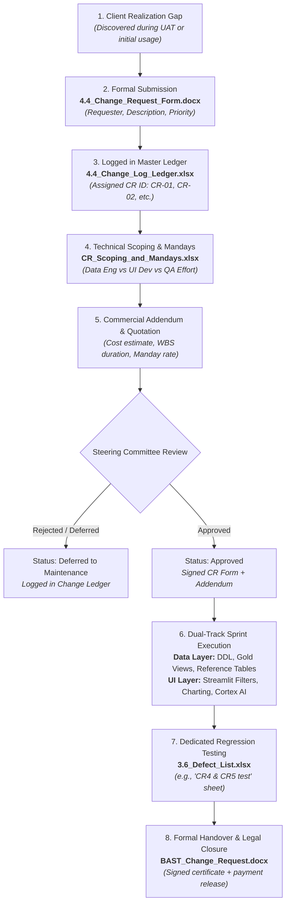

# The Enterprise Change Request (CR) Subsystem

> **Domain Context:** Enterprise IT Delivery & Client Solution Engineering  
> **Source Baseline:** Extracted from verified production deliverables (`4.4_Change_Request_Form`, `4.4_Change_Log_Ledger`, `CR_Scoping_and_Mandays`, `BAST_Change_Request`).  
> **Target Audience:** Solution Architects, Project Managers, Engineering Leads, and AI Automation Agents.

---

## 1. Subsystem Purpose & Real-World Mechanics

In enterprise consulting engagements, **Change Requests (CRs) represent client realization gaps**—critical business capabilities, filtering hierarchies, or analytics dimensions that the client should ideally have scoped into the baseline Functional Specification Document (FSD), but only realized they needed once they actively engaged with production-like data during User Acceptance Testing (UAT) or initial deployment.

Rather than disrupting the baseline project governance, enterprise delivery isolates these requests into a **dedicated, parallel Change Request Subsystem**. This ensures that:
1. Baseline delivery timelines (Milestone 1 and Milestone 2) remain legally protected.
2. New feature requests are formally scoped, effort-estimated, and commercially priced.
3. Technical debt and scope creep are intercepted before contaminating baseline architecture.
4. Additional consulting revenue is captured and formally accepted via dedicated legal certificates (`BAST_Change_Request`).

---

## 2. End-to-End Change Request Lifecycle Flow



---

## 3. The 4 Core Change Request Artifacts

| Phase in Subsystem | Deliverable Asset | Format | Operational Role & Contents |
| :--- | :--- | :--- | :--- |
| **1. Request & Impact** | `05_monitoring/4.4_Change_Request_Form_Template.docx` | `DOCX` | **Formal Change Proposal:** Documents CR ID, Requester, Change Category (Scope, Schedule, Requirement), Priority, Detailed Functional Description, Impact Analysis across Scope/Schedule/Cost/Resource, WBS effort breakdown, and dual-party steering sign-offs. |
| **2. Tracking & Audit** | `05_monitoring/4.4_Change_Log_Ledger_Template.xlsx` | `XLSX` | **Master Change Control Ledger:** Numerical registry logging CR ID, Date, Title, Category, Driver, Requester, Business Reason, Status (Open -> Under Review -> Impact Analysis Completed -> Approved -> Implemented -> Closed), and Steering Decisions. |
| **3. Engineering Scoping** | `07_internal_legal_contracts/CR_Scoping_and_Mandays_Template.xlsx` | `XLSX` | **Technical Manday Estimator:** Internal technical spreadsheet decomposing the exact development work days required across engineering layers (Data Engineering vs. Streamlit/UI vs. AI Engine). |
| **4. Legal Handover** | `07_internal_legal_contracts/BAST_Change_Request_Template.docx` | `DOCX` | **Legal Handover Certificate:** Bilateral delivery acceptance certificate signed by Client and Vendor Executive Sponsors, explicitly citing the formal Quotation Number (e.g. `0114258/00/MII/CS7/III/2026`) and releasing payment. |

---

## 4. Real-World Case Studies Extracted from Repository

Inspection of `4.4_Change_Log_Ledger.xlsx`, `4.4_Change_Request_Form.docx`, and `CR_Scoping_and_Mandays.xlsx` reveals the exact progression of real-world CRs on the enterprise delivery engagement:

### Case 1: Schedule Realignment (CR #1 — 27 Jan 2026)
* **Trigger:** Client accounting operations required moving the UAT commencement from 23 Feb 2026 to 20 Feb 2026.
* **Category:** *Schedule Change* (Driver: Resource Constraint).
* **Impact:** 0 additional mandays, but required adjusting team sprint velocity to deliver SIT pass gates 3 days earlier.

### Case 2: Hierarchy Aggregation & Section Merging (CR #2 — 23 Feb 2026)
* **Trigger:** During initial UAT, business users discovered that analyzing sales and gross profits by isolated individual sections (`IDK1`, `IDK5`, `IDK2`, `IDKA`) obscured corporate performance.
* **Category:** *Requirement Change* (Driver: Risk Materialization / User Feedback).
* **Technical Impact:**
  - **Data Layer:** Modified Snowflake Gold transformation views (`AO TCP16`) and reference mapping tables.
  - **UI Layer:** Added Department & Division level aggregations and dynamic UI filters in Operating Profit and PBT modules, plus countermeasure tracking in AR Overdue.

### Case 3: Visual Analytics Enhancement (CR #3 — 23 Feb 2026)
* **Trigger:** Department heads requested instant visual variance tracking rather than reading raw data tables.
* **Scope:** Added Actual vs. Budget Bar Charts and cumulative Actual vs. Budget Line Charts across 6 modules (Sales, Gross Profit, Operating Profit, Profit Before Tax, AR Overdue, Inventory Aging).

### Case 4: Predictive Financial Forecasting (CR #4 — 23 Feb 2026)
* **Trigger:** Client executive leadership realized historical actuals were insufficient; they required Q1 Actual vs. Forecast comparative analysis.
* **Scope:** Deployed multi-layer engineering involving Data Engineers (staging forecast tables), Streamlit Developers (forecast variance views), and Cortex AI Engineers (automated executive summarization narrations).

### Case 5: Inventory Aging Bucket Engine (CR #5 — 29 Apr 2026)
* **Trigger:** Accounting required multi-tier overdue aging buckets for stock, mirroring the existing AR Overdue architecture.
* **Internal Engineering Notes (from `CR_Scoping_and_Mandays.xlsx`):**
  > *"Tabel sama, nambah column UI. Mereka cuman mau lihat overdue pada bulan tertentu... User ingin menambah informasi untuk melihat semua overdue dari perhitungan 4 current months. Secara UI dia nambah satu tabel, behind the scenes, satu column."*
* **Architecture:** Injected 7 aging buckets: `0-30 days`, `31-120 days`, `121-180 days`, `181-360 days`, `361-720 days`, `721-1080 days`, `>1080 days`.

### Case 6: Dynamic Department Merging Engine (CR #6 — 10 Jun 2026)
* **Trigger:** The client underwent an internal organizational restructuring and required a dynamic UI feature allowing administrators to merge multiple departments into conglomerate business units (e.g. Supply Chain, Green Infrastructure, Corporate Administration).
* **Effort Breakdown (from `4.4_Change_Request_Form.docx`):**
  - **Total Effort:** **30 Mandays** across 17 calendar days (15 dev + 2 buffer).
  - *Analysis & PM:* 5 mandays
  - *Development:* 13 mandays
  - *Testing:* 10 mandays
  - *Deployment & Cutover:* 2 mandays
* **Resolution:** Formally delivered and accepted via `BAST_Change_Request_Template.docx` on **20 August 2026**.

---

## 5. Architectural Separation of Concerns

```text
┌────────────────────────────────────────────────────────┐
│               BASELINE DELIVERY TRACK                  │
│  FSD -> TSD -> SIT -> UAT -> BAST Milestone 1 & 2      │
│         (Defines core contractual scope)               │
└──────────────────────────┬─────────────────────────────┘
                           │ Intercepted Scope Variance
                           ▼
┌────────────────────────────────────────────────────────┐
│            CHANGE REQUEST (CR) SUBSYSTEM               │
│  CR Form -> Ledger -> Manday Scoping -> CR BAST        │
│    (Isolated commercial addendum & sprint buffer)      │
└────────────────────────────────────────────────────────┘
```

By enforcing this separation:
1. **Zero Contamination:** Core baseline milestones are delivered on schedule without waiting for complex client feature expansions.
2. **Audit Integrity:** Financial auditors can trace exactly why software features exist beyond the original FSD by cross-referencing CR Form IDs to executed BAST Change Request legal certificates.
