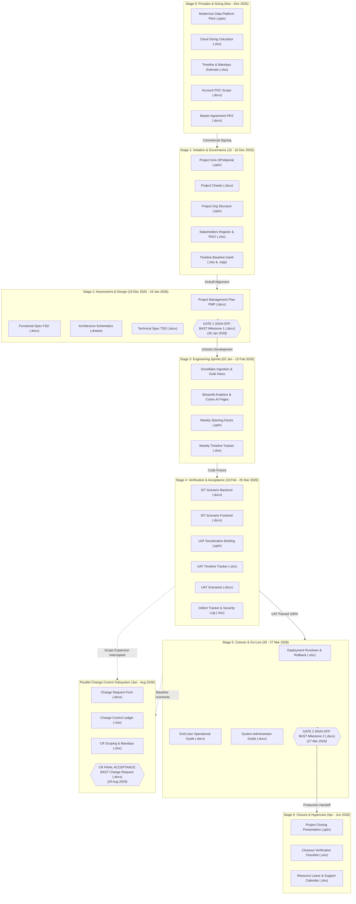
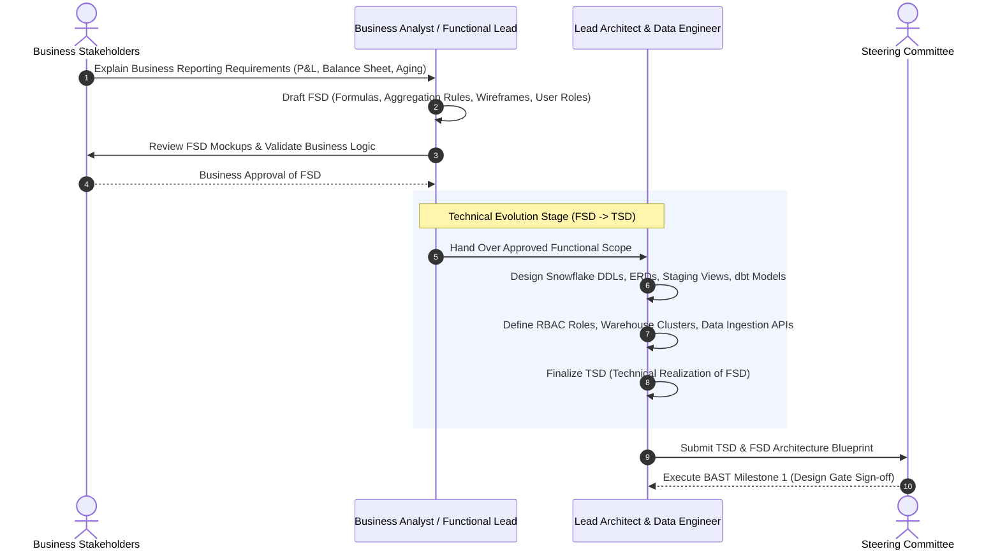
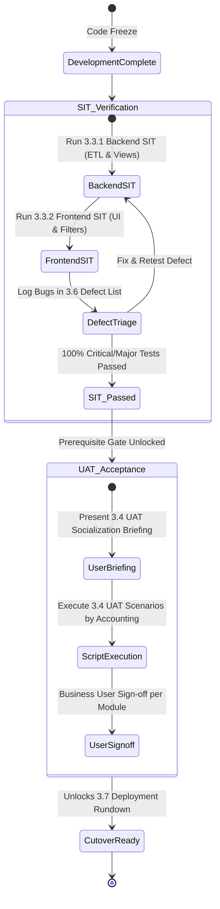

# Enterprise Deliverable Architecture & Lifecycle Blueprint

> **Reference Specification:** Enterprise Delivery Governance Model  
> **Exported Standalone Artifact:** Universal Lifecycle Flow, Stage-Gate Matrix, and Document Dependency Graphs.  
> **Target Project Baseline:** `TTI_Snowflake_Analytics` & Multi-Project Workbench Engine.

---

## 1. Master Chronological Flowchart

---

## 2. Document Evolution: The FSD to TSD Bridge

---

## 3. SIT to UAT Quality Verification Gate

