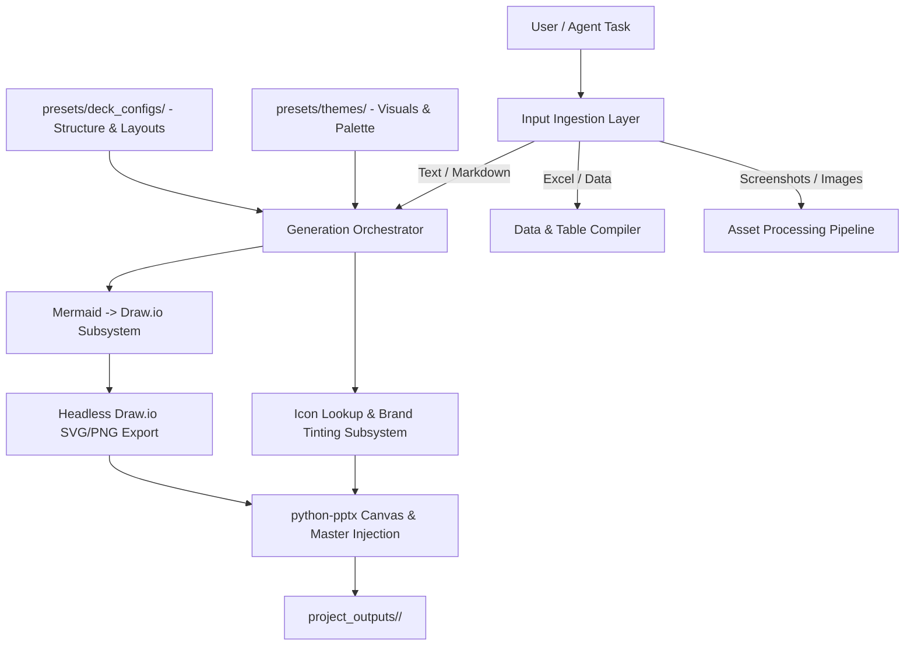

# Enterprise PPT Builder: Technical Specification & Roadmap

## 1. System Architecture & Component Separation

---

## 2. Decoupling: Thematic Presets vs. Deck Configurations

To prevent combinatorial explosion and retain modularity, visual styling is strictly separated from structural presentation blueprints:

### A. Thematic Presets (`presets/themes/<theme_name>.yaml`)
Handles pure visual aesthetics and branding:
- Color Palette: 60-30-10 rule (Background, Surface/Cards, Primary Slate, Accent Brand Hex).
- Typography: Header font family, body font family, tracking.
- Brand Assets: Approved logo paths (Light / Dark / Monochrome variants), watermarks.
- Container Styling: Corner radius for cards, hairline border widths/colors.

### B. Deck Configurations (`presets/deck_configs/<type_name>.yaml`)
Handles deck structure, flow, and required vs. optional slides:
- **Mandatory Slide Sequence**: Title $\rightarrow$ Executive Summary $\rightarrow$ Core Delivery $\rightarrow$ Next Steps.
- **Modular / Optional Slide Catalog**:
  - `appendix_technical`: Deep dive architecture & raw schema dumps.
  - `risk_matrix`: Likelihood vs. impact heat grid.
  - `references_glossary`: External link catalog & acronym dictionary.
  - `action_items_raci`: RACI matrix & owner assignment table.
- **Input Contract**: Declares expected inputs (e.g. requires 1 markdown summary + 1 Excel sheet for metrics).

---

## 3. Diagramming Pipeline (Mermaid to Draw.io)

1. **Mermaid Generation**: Agent outputs standard, clean Mermaid syntax (flowcharts, sequence, state, class diagrams).
2. **Translation to Draw.io (`.drawio` / `mxGraphModel`)**: Parser converts Mermaid nodes and edge connectors into mxGraph XML with auto-layout constraints.
3. **Headless Vector Export**: CLI exports `.drawio` to high-resolution PNG / SVG (`draw.io --export --format png --scale 2.5`).
4. **Slide Embedding**: Embedded into slide bounding boxes with full aspect ratio preservation.
5. **Traceability**: Raw `.drawio` source is saved directly inside `project_outputs/<project_name>/diagrams/` for manual editing if needed.

---

## 4. Icon Subsystem (Anti-Emoji Enforcement)

1. **Query & Fetch**: When an agent requests a concept icon (e.g. `icon_query("cloud_security")`), the lookup tool queries local SVG cache or Iconify API.
2. **Brand Dynamic Tinting**: The SVG fill / stroke is programmatically modified with the active Theme Preset accent color.
3. **Insertion**: Rendered directly as crisp vector / high-res raster on slide badge containers.

---

## 5. Output Sandboxing & Governance

- All outputs are sandboxed to `project_outputs/<project_timestamp_or_name>/`.
- The engine enforces a **Strict Write-Barrier**: the CLI/API rejects any write operation targeting `presets/`, `assets/`, or `src/`.

---

## 6. Workbench & Git Isolation for `docs/dev/`

- The `docs/dev/` directory is reserved for developer notes, architecture plans, and sprint tracking.
- A pre-push / branch hook or `.gitattributes` filter ensures `docs/dev/` is isolated to developer workbench branches and never merged into public distribution `main`.

---

## 7. Skill Recycling & Design / Taste Layer

### Skill Recycling (~70% leverage):
- Existing `.agents/skills/presentation-maker/` already provides core `python-pptx` coordinate math, card containers, zero-margin text frames, and baseline 16:9 slide layout recipes.
- We recycle the layout math and wrap it around our Theme/Config YAML layers.

### The "Taste & Wow" Layer:
Functional generation creates organized boxes; "client-wow" design requires:
1. **Visual Hierarchy & Typography Scaling**: Large 40pt+ metric anchors with tight, muted labels.
2. **Negative Space (Whitespace)**: Strict padding enforcement (minimum 0.4" slide margins and 0.2" card gaps).
3. **Surface Layering**: Subtle tinted cards (`#F8F9FA` on `#FFFFFF` or elevated card fills) rather than flat wireframes.
4. **Asymmetrical Layout Balance**: 1/3 narrative takeaway column + 2/3 structured data/visual canvas.
