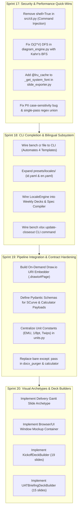

# Platform Upgrade, Security Hardening & Architecture Audit Briefing

> **Date:** 2026-09-18  
> **Repository:** `enterprise-bench` | **Branch:** `main`  
> **Scope:** Multi-Engine Architecture (`src/core/`, `src/docx_engine/`, `src/ppt_engine/`, `src/xlsx_engine/`, `src/cli.py`)  
> **Ledger Reference:** [`docs/CHANGELOG.md`](../CHANGELOG.md) | **Active Pointer:** [`HANDOVER.md`](../../HANDOVER.md)  
> **Operating Guardrail:** [`AGENTS.md`](../../AGENTS.md) (Strict **ZERO INTERMEDIATE UNIT TESTING**).

---

## 1. Executive Summary & Platform Calibration

A deep architectural, computational, and security audit of the Enterprise Workbench was conducted across the engine codebase (`src/`), golden master deliverable templates (`clean_workspace/`), configuration presets (`presets/`), and system runbooks (`docs/specs/`).

The workbench has achieved a high degree of maturity, automating over 50% of the 38 production master templates with deterministic OpenXML, DrawingML, and openpyxl engines. However, rapid multi-engine feature expansion has introduced architectural debt, performance bottlenecks, and security exposures across four distinct areas:

```
┌────────────────────────────────────────────────────────────────────────────────────────┐
│                                PLATFORM AUDIT FINDINGS                                 │
├──────────────────────────┬──────────────────────────┬──────────────────────────────────┤
│ 🛡️ Track A: Security     │ ⚡ Track B: Performance │ 📐 Track C: API Contracts        │
│ • Shell=True Injection   │ • O(2^V) DAG Traversal   │ • 10 Vital Undocumented APIs     │
│ • Unbounded SSRF Fetch   │ • Uncached Font Disk I/O │ • Bare `except: pass` Swallowing │
│ • PII Case-Match Bug     │ • 19-Pass XML Tree Query │ • Untyped CLI & Engine Payloads  │
├──────────────────────────┴──────────────────────────┴──────────────────────────────────┤
│ 🚀 Track D: Feature Roadmap & 38 Master Templates Coverage                             │
│ • 4 CR Templates fully coded in engine but disconnected from CLI (`bench cr file`)     │
│ • Draw.io headless URI embedder needed for live spec compilation (`.drawio#Page`)      │
│ • Bilingual catalog expansion required to complete active `id`/`en` sprint             │
└────────────────────────────────────────────────────────────────────────────────────────┘
```

---

## 2. Track A: Security, Robustness & Defensive Hardening

### A1. Arbitrary Command Injection via `shell=True` in Desktop Review
- **Locations:** [`src/cli.py:339`](../../src/cli.py#L339) and [`src/cli.py:384`](../../src/cli.py#L384)
- **Severity:** 🔴 **Critical**
- **Vulnerability:**
  In `bench ppt generate --open` and `bench ppt replace-image --open`, desktop launch commands are constructed using f-strings and passed to `subprocess.run(cmd, shell=True)`:
  ```python
  cmd = f'open -a "Microsoft PowerPoint" "{saved_file.resolve()}" && osascript -e \'tell application "Microsoft PowerPoint" to activate\''
  subprocess.run(cmd, shell=True)
  ```
  If `saved_file` contains double quotes, backticks, or shell metacharacters (`$(...)`), arbitrary shell execution occurs.
- **Remediation:** Remove `shell=True` entirely. Execute discrete parameter lists:
  ```python
  subprocess.run(["open", "-a", "Microsoft PowerPoint", str(saved_file.resolve())], check=False)
  subprocess.run(["osascript", "-e", 'tell application "Microsoft PowerPoint" to activate'], check=False)
  ```

### A2. Unbounded Remote Download & SSRF in `ResourceManager`
- **Location:** [`src/ppt_engine/resource_manager.py:149-166`](../../src/ppt_engine/resource_manager.py#L149-L166) (`_silent_download`)
- **Severity:** 🟠 **High**
- **Vulnerability:**
  1. **Unbounded Heap Read:** `content = resp.read()` performs an unconstrained read without content-length limits, creating an Out-of-Memory (OOM) DoS vector if a remote server streams an infinite payload.
  2. **SSRF Risk:** Accepts arbitrary URL schemes (`file://`, `ftp://`) and does not filter link-local/cloud metadata IPs (`169.254.169.254`, `127.0.0.1`, `10.0.0.0/8`).
  3. **File Type Spoofing:** Does not validate image magic bytes or MIME types before saving binaries to disk.
- **Remediation:**
  - Restrict URL schemes strictly to `http://` and `https://`.
  - Cap download stream size at 25MB (`resp.read(25 * 1024 * 1024)`).
  - Verify image magic numbers (PNG `\x89PNG`, JPEG `\xFF\xD8\xFF`, SVG XML root) prior to writing to `spec.target_path`.

### A3. Silent Failure & False-Positive Reports in `docx_purger.py`
- **Location:** [`src/core/docx_purger.py:84, 94, 103, 142`](../../src/core/docx_purger.py#L84)
- **Severity:** 🟠 **High**
- **Vulnerability:**
  `purge_docx_elements` wraps XML modifications in bare `except Exception: pass` blocks. If an XML part is malformed, encoded atypically, or fails to parse, the exception is silently ignored, unpurged comments/highlights remain in the deliverable, and `PurgeReport.success` reports `True`.
- **Remediation:** Catch `etree.XMLSyntaxError` explicitly, populate `report.error_message`, and set `report.success = False` whenever an XML part fails to sanitize.

### A4. PII Handler Case-Sensitivity Bypasses & Run Formatting Loss
- **Locations:**
  - [`src/core/pii/handlers/docx_handler.py:157`](../../src/core/pii/handlers/docx_handler.py#L157)
  - [`src/core/pii/handlers/pptx_handler.py:151`](../../src/core/pii/handlers/pptx_handler.py#L151)
  - [`src/core/slug_registry.py:329-330`](../../src/core/slug_registry.py#L329-L330)
- **Severity:** 🟡 **Medium**
- **Vulnerability:**
  1. **Case-Sensitivity Defect:** Handlers execute `if target in new_val:` before `re.sub(..., flags=re.IGNORECASE)`. If `target` is lowercase (`"toyota"`) and the document text is `"Toyota"`, the substring check evaluates to `False`, skipping redaction entirely.
  2. **Format Stripping:** In `slug_registry.py`, `p.text = p.text.replace(slug, str(val))` resets `paragraph.text` directly, wiping all child run formatting (bold, italics, colors, custom fonts) across the entire paragraph.
- **Remediation:** Precompile a single case-insensitive regex union for PII redaction. In `slug_registry.py`, perform cross-run token replacement using run-aware text reconstruction.

### A5. Missing High-Entropy Secret & Key Detectors
- **Location:** [`src/core/pii/detectors.py:211-219`](../../src/core/pii/detectors.py#L211-L219)
- **Severity:** 🟡 **Medium**
- **Vulnerability:**
  `DetectorPipeline` detects emails, phone numbers, Indonesian NIK/NPWP, and contract numbers, but has no patterns for:
  - AWS access keys (`AKIA[0-9A-Z]{16}`)
  - Private key blocks (`-----BEGIN (RSA|EC|OPENSSH) PRIVATE KEY-----`)
  - Bearer tokens, Snowflake passwords, or JWTs.
- **Remediation:** Introduce `CredentialDetector` in `detectors.py` targeting high-entropy auth headers and private key blocks.

---

## 3. Track B: Performance & Engine Optimization

### B1. $O(2^V)$ Exponential Graph Traversal in Diagram Ranking
- **Location:** [`src/ppt_engine/diagram_engine.py:1021-1046`](../../src/ppt_engine/diagram_engine.py#L1021-L1046) (`_assign_ranks`)
- **Impact:** Complete CLI freeze / `RecursionError` on large architecture topologies.
- **Analysis:**
  `dfs(curr, current_rank, path)` traverses all simple paths in a DAG without memoizing maximum rank visits. In converging diamond topologies, this triggers exponential $O(2^V)$ recursive calls and allocates thousands of path sets (`path | {neighbor}`).
- **Optimization:** Replace DFS with Kahn's algorithm or topological sort with longest-path memoization ($O(V + E)$):
  ```python
  def _assign_ranks(self, diagram: ParsedDiagram, adj: Dict[str, Set[str]], rev_adj: Dict[str, Set[str]]) -> Dict[str, int]:
      in_degree = {nid: len(preds) for nid, preds in rev_adj.items()}
      queue = deque([nid for nid, deg in in_degree.items() if deg == 0])
      ranks = {nid: 0 for nid in queue}
      while queue:
          curr = queue.popleft()
          for succ in adj.get(curr, set()):
              ranks[succ] = max(ranks.get(succ, 0), ranks[curr] + 1)
              in_degree[succ] -= 1
              if in_degree[succ] == 0:
                  queue.append(succ)
      return ranks
  ```

### B2. Uncached TrueType System Font Disk I/O in Headless Slide Rendering
- **Location:** [`src/ppt_engine/slide_exporter.py:53-94`](../../src/ppt_engine/slide_exporter.py#L53-L94) (`_get_system_font`)
- **Impact:** 5x–10x slowdown in slide PNG generation.
- **Analysis:**
  `_get_system_font` is called on **every text run** across all slides. It executes multiple `os.path.exists()` checks and invokes `ImageFont.truetype()`, reading font files (`Helvetica.ttc`, `Arial.ttf`) from disk thousands of times per presentation.
- **Optimization:** Decorate `_get_system_font` with `@functools.lru_cache(maxsize=128)`.

### B3. Redundant OpenXML Zip I/O & In-Memory Package Buffering
- **Location:** [`src/core/docx_purger.py:66-70, 145-147`](../../src/core/docx_purger.py#L66-L70)
- **Impact:** Heavy RAM consumption (100MB+ per 40MB spec) and wasted CPU cycles.
- **Analysis:**
  `docx_purger.py` reads every entry of the zip archive into memory (`items_data = {}`) and re-compresses all media and XML files with `ZIP_DEFLATED`.
- **Optimization:** Stream unmodified entries directly from the source archive to the target archive preserving their original compression type, modifying only XML parts in `word/`.

### B4. 19-Pass XML DOM Traversal in Document Purging
- **Location:** [`src/core/docx_purger.py:117-140`](../../src/core/docx_purger.py#L117-L140)
- **Impact:** ~1,000,000 DOM element queries on large specifications.
- **Analysis:**
  Performs 19 separate passes (`findall` + `strip_elements`) over each document XML part to remove deletions, format change markers, comment anchors, and highlights.
- **Optimization:** Consolidate into a single-pass iteration (`for elem in list(root.iter()): if elem.tag in target_tags: elem.getparent().remove(elem)`).

### B5. OpenXML DOM Serialization Thrashing in Slug Substitution
- **Location:** [`src/core/slug_registry.py:321-347`](../../src/core/slug_registry.py#L321-L347)
- **Impact:** 100,000+ DOM-to-string serializations per document.
- **Analysis:**
  Iterates over every slug $S$ for every paragraph $P$ checking `if slug in p.text:`. In python-docx, evaluating `p.text` serializes the paragraph XML DOM to string.
- **Optimization:** Fast-reject check: evaluate `p_text = p.text` once per paragraph; if `'[' not in p_text`, skip immediately to the next paragraph.

---

## 4. Track C: Documentation Debt & Vital API Contracts

### C1. Top 10 Vital Functions with Highest Documentation Debt

| Rank | Subsystem | Function Name | Location | Crucial API Contract & Documentation Debt |
| :--- | :--- | :--- | :--- | :--- |
| **1** | `docx_engine` | `parse_markdown_content` | [`src/docx_engine/spec_compiler.py:685-828`](../../src/docx_engine/spec_compiler.py#L685-L828) | **AST Parsing Engine (144 lines):** Custom regex line-by-line state machine without grammar documentation. Undocumented magic number (`len(paragraphs) > 5` for page breaks) and unhandled nested list structures. |
| **2** | `ppt_engine` | `DiagramRenderer.render_svg` | [`src/ppt_engine/diagram_engine.py:1627-1836`](../../src/ppt_engine/diagram_engine.py#L1627-L1836) | **SVG Vector Compiler (210 lines):** Undocumented obstacle avoidance math (`max_obst_r + 24.0`), gutter channel routing, and in-place mutation of input diagram edges. |
| **3** | `ppt_engine` | `HierarchicalLayoutEngine._detect_and_route_buses` | [`src/ppt_engine/diagram_engine.py:868-980`](../../src/ppt_engine/diagram_engine.py#L868-L980) | **Trunk Line Router (113 lines):** Destructively filters `diagram.edges` in place without documenting side effects or idempotency constraints. Channel spacing math is undocumented. |
| **4** | `core` | `purge_docx_elements` | [`src/core/docx_purger.py:40-160`](../../src/core/docx_purger.py#L40-L160) | **OpenXML Purger (121 lines):** 4 bare `except: pass` blocks. Does not document why root XML elements in `comments.xml` must be retained to prevent Word repair dialogs. |
| **5** | `ppt_engine` | `DrawIOConverter._build_edge_style` | [`src/ppt_engine/diagram_engine.py:1546-1608`](../../src/ppt_engine/diagram_engine.py#L1546-L1608) | **mxGraph Edge Math (63 lines):** Zero docstring. Undocumented geometric alignment threshold (`0.45`), normalized attachment faces `[0.0, 1.0]`, and direction vectors. |
| **6** | `xlsx_engine` | `calculate_cloud_sizing` | [`src/xlsx_engine/cloud_sizing.py:114-220`](../../src/xlsx_engine/cloud_sizing.py#L114-L220) | **Financial Sizing (107 lines):** **Silent Data Loss:** Hardcoded `range(8)` silently drops warehouses past index 7 without raising an exception or logging a warning. |
| **7** | `xlsx_engine` | `SCurveGenerator.generate_curve_data` | [`src/xlsx_engine/s_curve_generator.py:185-288`](../../src/xlsx_engine/s_curve_generator.py#L185-L288) | **S-Curve Engine (104 lines):** Accepts untyped `milestones: List[Dict[str, Any]]` with ambiguous fallback between 0-based and 1-based indexing. |
| **8** | `xlsx_engine` | `CalculatorStamper._apply_data` | [`src/xlsx_engine/calculator_stamper.py:75-144`](../../src/xlsx_engine/calculator_stamper.py#L75-L144) | **Template Data Population (70 lines):** Zero docstrings. Polymorphic dictionary input with 3 bare `except: pass` blocks swallowing invalid cell coordinates. |
| **9** | `ppt_engine` | `build_chapter_divider_slide` | [`src/ppt_engine/consulting_archetypes.py:1085-1270`](../../src/ppt_engine/consulting_archetypes.py#L1085-L1270) | **Split Layout Builder (186 lines):** Undocumented DrawingML alpha scaling ($100\% = 100,000$ integer units) and silent exception trap during XML injection. |
| **10** | `ppt_engine` | `SlideValidator._check_text_overflow` | [`src/ppt_engine/slide_validator.py:508-570`](../../src/ppt_engine/slide_validator.py#L508-L570) | **Overflow Guard (63 lines):** Zero documentation of empirical optical multipliers (`char_w = avg_font_pt * 0.52`). Valid only for proportional Latin sans-serifs. |

### C2. Unit & Coordinate Standardization Constants
The codebase contains implicit conversions between 5 incompatible unit spaces:
- Points (`Pt`), Inches (`Inches`), English Metric Units (`EMU`), OpenXML eighths of a point, and DrawingML alpha thousandths of a percent.
- **Remediation:** Centralize these conversions into `src/core/units.py`:
  ```python
  EMU_PER_INCH = 914400
  EMU_PER_PT = 12700
  DRAWINGML_ALPHA_MAX = 100000
  OPENXML_BORDER_SZ_PER_PT = 8
  TWIPS_PER_PT = 20
  ```

### C3. Canonical Pydantic v2 Models for Untyped Payloads
- Replace untyped dictionaries in CLI commands (`bench xlsx calculate`, `bench xlsx s-curve`) with strongly-typed Pydantic models: `SCurveInputPayload`, `CalculatorDataPayload`, and `SpecMetadataModel`.

### C4. Theme Model Duality
- `EnterpriseTheme` in `src/core/theme.py` and `Theme` in `src/ppt_engine/theme_engine.py` duplicate theme definitions with divergent property accessors. They must be merged into a unified Pydantic schema referencing `presets/themes/*.yaml`.

---

## 5. Track D: Feature Roadmap & 38 Master Templates Automation

### D1. Master Template Automation Coverage Matrix
Audit of the 38 production master templates in [`CATALOG.md`](../../CATALOG.md):

| Category | Count | Percentage | Master Templates Covered |
| :--- | :---: | :---: | :--- |
| **Fully Automated** | 20 | 52.6% | `POC_Scope`, `Cloud_Sizing`, `Project_Charter`, `Stakeholders_Register`, `FSD`, `FSD_Architecture.drawio`, `TSD`, `SIT_Backend`, `SIT_Frontend`, `UAT_Scenario`, `Defect_List`, `MoM`, `Weekly_Progress_Deck`, `Weekly_Progress_Timeline`, `Risk_Register`, `Issue_Log`, `BAST_Milestone_1`, `BAST_Milestone_2`, `BAST_CR`, `PKS` |
| **Engine Ready (Missing CLI Wiring)** | 5 | 13.2% | `Change_Request_Form.docx`, `Change_Log_Ledger.xlsx`, `CR_Scoping_and_Mandays.xlsx` (handled by `ChangeRequestProcessor` in `src/core/change_request.py`), `Project_Closeout_Checklist.xlsx` (in `ledger_models.py`), `Project_Org_Structure.pptx` |
| **Generic Spreadsheet Injection** | 5 | 13.2% | `Mandays_Estimate`, `Project_Timeline_Baseline`, `Timeline_UAT`, `Rundown_Deployment`, `Resource_Leave_Schedule` (handled via generic `bench xlsx calculate` without domain models) |
| **Delivery Gaps (Decks / Specs)** | 7 | 18.4% | `Pitch_Deck` (36 slides), `Kick-off_Material` (19 slides), `Sosialisasi_UAT` (15 slides), `Project_Closing_Deck` (9 slides), `PMP_Template.docx`, `User_Guide.docx`, `Admin_Guide.docx` |
| **Architectural Boundary** | 1 | 2.6% | `Project_Timeline_Baseline.mpp` (Microsoft Project proprietary binary format; PM desktop native) |

### D2. Immediate High-Leverage CLI Wiring: `bench cr file`
The Change Request subsystem (`src/core/change_request.py`) is fully implemented with automated numbering, mandays calculations, and ledger updates. Adding `bench cr file` to `src/cli.py` will **immediately automate 4 templates in a single commit**:
1. `4.4_Change_Request_Form_Template.docx`
2. `4.4_Change_Log_Ledger_Template.xlsx`
3. `CR_Scoping_and_Mandays_Template.xlsx`
4. `BAST_Change_Request_Template.docx`

### D3. On-Demand Draw.io URI Embedder for Markdown & PPTX
Currently, Draw.io diagrams can be compiled into `.drawio` and exported to PNG via CLI (`bench diagram export-all`), but Markdown specs and PPTX decks require manual intermediate PNG paths.
- **Proposal:** Implement an On-Demand URI Resolver in `src/ppt_engine/diagram_engine.py`:
  - Syntax: `` or ``
  - Automatically rasterizes the requested page to `output/.cache/diagrams/` at high DPI on demand.

### D4. Active Bilingual Sprint (`presets/locales/` Expansion)
- `LocaleEngine` (`src/core/locale_engine.py`) is implemented and functional.
- `presets/locales/en.yaml` and `id.yaml` only cover 5 reference slides.
- **Required Expansion:** Expand dictionaries to cover `weekly_progress.*`, consulting archetypes, spec compiler callouts (`> [!NOTE]` ➔ `CATATAN`), and legal contract dates (Indonesian month names: *Januari*, *Februari*, etc.).

### D5. Slide Archetype Suite Expansion
Expand `src/ppt_engine/consulting_archetypes.py` with 4 consulting staples:
1. **Delivery Gantt Timeline (`build_timeline_gantt_slide`):** Calendar axis with horizontal workstream bars and milestone diamonds.
2. **Browser / UI Application Mockup (`build_ui_mockup_slide`):** Desktop browser frame with URL bar and telemetry badges to eliminate raw ERP screenshot debt.
3. **Harvey Balls Feature Evaluation Matrix (`build_feature_matrix_slide`):** Scorecard with filled/half/empty glyphs (`● ◐ ○`) for vendor/architecture trade-offs.
4. **Normalized Vector Tech Grid (`build_tech_logo_grid_slide`):** 4-to-6 column card grid utilizing SVG emblems from `assets/logos/`.

---

## 6. Actionable Implementation Sprints



---

## 7. Immediate Next Steps
1. **Authorize Sprint 17 Quick-Wins:** Apply the 4 immediate P0 security and performance patches (`shell=True`, `_assign_ranks` BFS, font `@lru_cache`, PII case-match).
2. **Review & Prioritize Sprints 18–20:** Validate the backlog order for the Change Request CLI command, bilingual catalogs, and Draw.io URI embedder.
