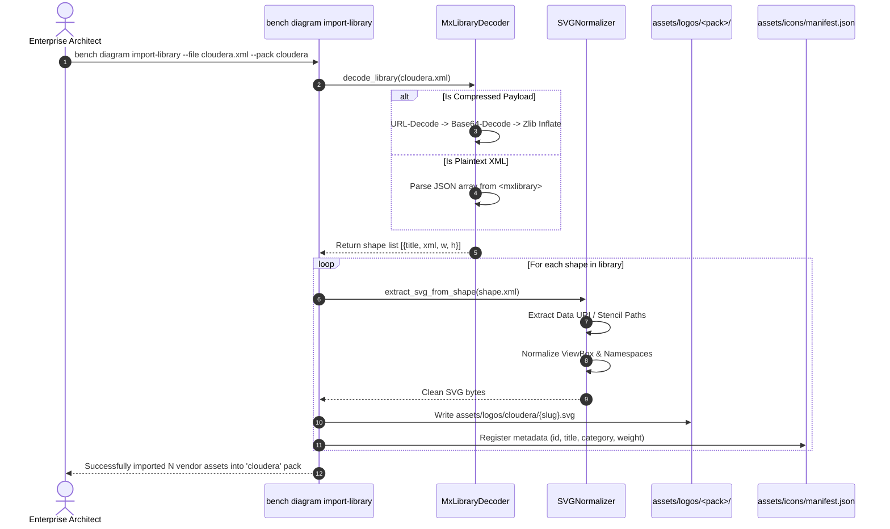
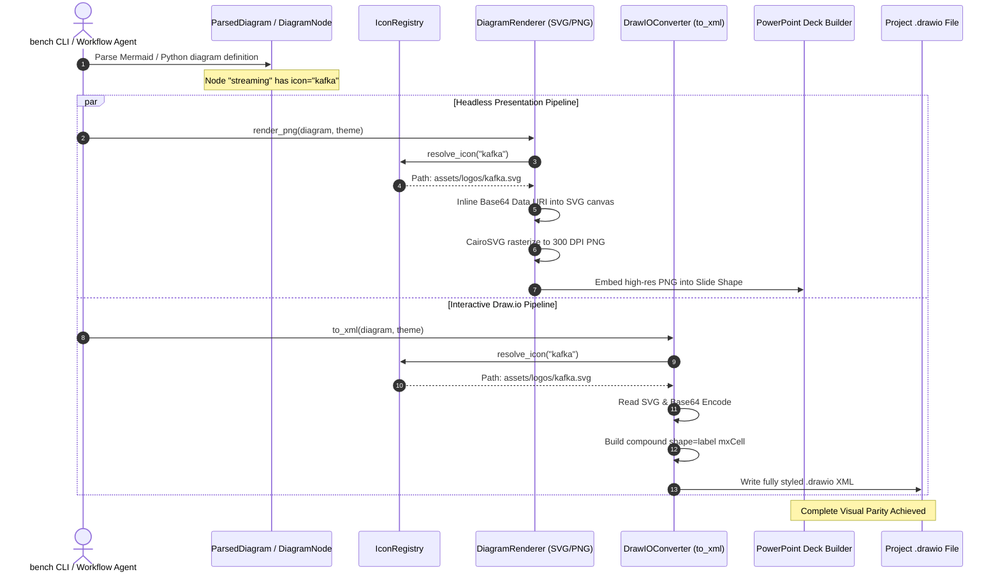

# Architecture & Design Specification: Native Draw.io Icon System & External Library Integration

> **Target Role:** Core Platform Engineer / Diagram Engine Maintainer (`enterprise-bench-dev`, `enterprise-bench-ops`)  
> **Topic:** Native Draw.io XML Icon Integration, Compound Shapes, External Vendor Libraries (Cloudera, Snowflake, Databricks), and Dual-Mode Stencil Resolution  
> **Status:** Approved Architectural Specification  
> **Target Subsystems:** [`src/ppt_engine/diagram_engine.py`](../../src/ppt_engine/diagram_engine.py), [`src/cli.py`](../../src/cli.py), [`assets/logos/`](../../assets/logos/), [`assets/icons/`](../../assets/icons/)  
> **Related Documents:** [adr_drawio_pipeline_vs_mcp.md](adr_drawio_pipeline_vs_mcp.md), [../backlog/diagram_architecture.md](../backlog/diagram_architecture.md), [ingress_bus_routing_architecture.md](ingress_bus_routing_architecture.md), [LIFECYCLE.md](../../LIFECYCLE.md)

---

## 1. Executive Summary & Problem Context

Enterprise architecture deliverables (Solution Blueprints, Functional Specs, Technical Specifications, Cutover Runbooks) require dual-target visual assets:
1. **Headless Presentation Artifacts (Static):** High-resolution raster images (PNG, $300\text{ DPI}$, 16:9 aspect ratio) embedded directly into executive PowerPoint slides (`.pptx`) and Word contracts (`.docx`).
2. **Interactive Diagram Files (Dynamic / Editable):** Source `.drawio` XML files handed over to enterprise client architects, PMOs, and engineering leads for iterative governance, reviews, and post-engagement maintenance.

### 1.1 The Current Implementation & The XML Export Defect

In [`src/ppt_engine/diagram_engine.py`](../../src/ppt_engine/diagram_engine.py), the diagram subsystem generates both SVG/PNG images and `.drawio` XML from an internal abstract syntax tree (`ParsedDiagram`, `DiagramNode`, `DiagramEdge`).

#### Headless Pipeline (Functional)
In `to_svg()` (lines 1515–1538), when a node defines an icon or logo via `node.custom_style["icon"]` (e.g. `assets/logos/snowflake.svg`), the engine reads the local SVG from disk, optionally recolors it, converts it to a base64 Data URI, and inlines an `<image xlink:href="data:image/svg+xml;base64,..." />` tag. When compiled through CairoSVG / Python Cairo, the resulting PNG renders crisp vector logos directly inside presentation cards.

#### Draw.io XML Pipeline (The Defect)
In `DrawIOConverter.to_xml()` (lines 1217–1220), node styling is serialized as:
```python
if "icon" in node.custom_style:
    style_parts.append(f"icon={node.custom_style['icon']};")
if "icon_color" in node.custom_style:
    style_parts.append(f"icon_color={node.custom_style['icon_color']};")
```
This produces an `mxCell` style string such as:
```xml
<mxCell id="node_streaming" value="Apache Kafka" 
        style="rounded=1;whiteSpace=wrap;html=1;arcSize=14;fillColor=#FFFFFF;strokeColor=#0284C7;icon=assets/logos/kafka.svg;" 
        vertex="1" parent="1">
```

> [!WARNING]
> **The Draw.io GUI Defect:**
> `icon=assets/logos/...` is a phantom internal key. The official Draw.io Desktop application, the Draw.io web application (app.diagrams.net), and the VS Code Draw.io extension **completely ignore** this attribute. When client reviewers or architects open the `.drawio` file, **no icon is rendered**. The node appears as an empty plain box, stripping the diagram of its technology identity and visual polish.

### 1.2 The Business & Architectural Mandate

Enterprise consulting deliverables must never deliver degraded or broken files. The diagram pipeline must achieve **100% visual parity** between the headless slide preview and the interactive `.drawio` document.

Furthermore, real-world enterprise architectures frequently feature technology stacks beyond generic cloud shapes:
* **Modern Data & Streaming:** Apache Kafka, Apache Flink, Confluent, dbt, Snowflake, Databricks Unity Catalog.
* **Enterprise Big Data & Legacy On-Premises:** Cloudera Data Platform (CDP), Apache Ozone, Apache NiFi, Apache Impala, Apache Atlas, Apache Ranger.
* **Enterprise Security & Infrastructure:** HashiCorp Vault, CyberArk, Active Directory, Palo Alto Networks.

This document establishes the end-to-end architecture to:
1. Fix `.drawio` XML serialization by injecting native Draw.io vector image cells.
2. Ingest external vendor library files (`.xml` Draw.io libraries) into our repository asset catalog.
3. Bridge native `mxgraph.*` stencils to local SVG caches for headless Python rendering.

---

## 2. Under the Hood: The 3 Draw.io Icon Mechanisms

To design an interoperable system, we must examine how Draw.io and its core layout engine, **mxGraph**, handle visual shapes and external iconography.

```
┌────────────────────────────────────────────────────────────────────────────────────────┐
│                               DRAW.IO ICON MECHANISMS                                 │
└────────────────────────────────────────────────────────────────────────────────────────┘
            │                                 │                                │
            ▼                                 ▼                                ▼
┌───────────────────────┐         ┌───────────────────────┐        ┌───────────────────────┐
│  Mechanism 1: Native  │         │  Mechanism 2: Direct  │        │  Mechanism 3: Library │
│    mxGraph Stencils   │         │    Vector Data URIs   │        │     XML Packages      │
├───────────────────────┤         ├───────────────────────┤        ├───────────────────────┤
│ shape=mxgraph.<lib>   │         │ shape=image;image=... │        │ <mxlibrary>[...]      │
│ Built into Draw.io JS │         │ Self-contained in XML │        │ Vendor distribution  │
│ (AWS, GCP, Azure)     │         │ Zero missing assets   │        │ (Cloudera, Databricks)│
└───────────────────────┘         └───────────────────────┘        └───────────────────────┘
```

### 2.1 Mechanism 1: Native mxGraph Stencils (`shape=mxgraph.<lib>.<shape>`)

Draw.io bundles several native stencil packs directly into its client JavaScript bundle:
* AWS (`shape=mxgraph.aws4.*`)
* Google Cloud (`shape=mxgraph.gcp2.*`)
* Microsoft Azure (`shape=mxgraph.azure.*`)
* Cisco Networking (`shape=mxgraph.cisco.*`)

#### How It Works in mxGraph XML
A cell references the stencil identifier in its style string:
```xml
<mxCell id="aws_s3" value="Amazon S3" 
        style="shape=mxgraph.aws4.bucket;fillColor=#E05243;strokeColor=none;verticalLabelPosition=bottom;verticalAlign=top;align=center;html=1;" 
        vertex="1" parent="1">
  <mxGeometry x="200" y="150" width="48" height="48" as="geometry"/>
</mxCell>
```

#### Engine Pros & Cons
* **Pros:** Extremely compact XML; native vector scaling in Draw.io GUI; supports color customization via `fillColor` and `strokeColor`.
* **Cons:** 
  - **Headless Incompatibility:** Python (`cairosvg`, `reportlab`, `pillow`) cannot render `shape=mxgraph.aws4.bucket` because the shape's path data resides inside Draw.io's proprietary JavaScript shape registry.
  - **Limited Catalog:** Vendor tools outside hyperscalers (e.g. Cloudera CDP components, specialized SaaS platforms) are not present in native mxGraph stencils.

### 2.2 Mechanism 2: Embedded Vector Data URIs (`shape=image;image=data:image/svg+xml,...`)

Draw.io natively supports cells whose visual representation is an embedded raster or vector image. The image is encoded as a Data URI directly inside the `image` style property.

#### How It Works in mxGraph XML
Data URIs can be embedded either as base64-encoded or RFC-3986 URL-encoded SVG strings:
```xml
<!-- Embedded Base64 Vector SVG -->
<mxCell id="node_kafka" value="Apache Kafka" 
        style="shape=image;html=1;verticalAlign=top;verticalLabelPosition=bottom;labelBackgroundColor=#ffffff;imageAspect=1;aspect=fixed;image=data:image/svg+xml;base64,PHN2ZyB4bWxucz0iaHR0cDovL3d3dy53My5vcmcvMjAwMC9zdmciIHdpZHRoPSI0OCIgaGVpZ2h0PSI0OCI+...PC9zdmc+;" 
        vertex="1" parent="1">
  <mxGeometry x="120" y="100" width="48" height="48" as="geometry"/>
</mxCell>
```

Alternatively, Draw.io supports **Compound Label Shapes (`shape=label`)** where a card contains both an embedded image and text within a single atomic cell:
```xml
<!-- Compound Card with Embedded Icon and Label -->
<mxCell id="node_snowflake" value="Snowflake EDW" 
        style="shape=label;image=data:image/svg+xml;base64,PHN2Zy...;imageWidth=32;imageHeight=32;imageAlign=left;spacingLeft=44;rounded=1;arcSize=14;fillColor=#FFFFFF;strokeColor=#0284C7;strokeWidth=1.5;fontColor=#0F172A;fontFamily=Segoe UI;fontSize=13;fontStyle=1;whiteSpace=wrap;html=1;" 
        vertex="1" parent="1">
  <mxGeometry x="340" y="100" width="190" height="68" as="geometry"/>
</mxCell>
```

#### Engine Pros & Cons
* **Pros:**
  - **100% Self-Contained:** The `.drawio` file has zero external dependencies or broken asset paths. It opens identically on any machine, offline or online, in web or desktop.
  - **Immediate Visual Parity:** Draw.io renders the exact same SVG vector path that Cairo renders in slide PNG exports.
  - **Atomic Interaction:** In compound `shape=label` mode, moving or resizing the node moves the logo and text together without grouping or unbundling issues.
* **Cons:** Larger XML file sizes (typically $+2\text{ KB}$ to $+6\text{ KB}$ per unique icon).

### 2.3 Mechanism 3: Draw.io Library XML Packages (`<mxlibrary>[...]</mxlibrary>`)

In real-world enterprise engagements, vendor solution architects (Cloudera, Databricks, Snowflake, Confluent) do not modify Draw.io's core source code. Instead, they publish and distribute **Custom Draw.io Libraries** (`.xml` files).

#### Format & Packaging Structure
A Draw.io library file begins with an `<mxlibrary>` root tag wrapping a JSON array of serialized shape descriptors:
```xml
<mxlibrary>[
  {
    "xml": "&lt;mxGraphModel&gt;&lt;root&gt;&lt;mxCell id=\"0\"/&gt;&lt;mxCell id=\"1\" parent=\"0\"/&gt;&lt;mxCell id=\"2\" value=\"Cloudera NiFi\" style=\"shape=image;image=data:image/svg+xml;base64,...;\" vertex=\"1\" parent=\"1\"&gt;&lt;mxGeometry width=\"48\" height=\"48\" as=\"geometry\"/&gt;&lt;/mxCell&gt;&lt;/root&gt;&lt;/mxGraphModel&gt;",
    "w": 48,
    "h": 48,
    "title": "Cloudera NiFi"
  },
  {
    "xml": "...",
    "w": 48,
    "h": 48,
    "title": "Cloudera Ozone"
  }
]</mxlibrary>
```

#### Compression Variations
Draw.io libraries in the wild come in two distinct encodings:
1. **Plaintext JSON Array:** As shown above, containing XML strings with HTML entity escaping (`&lt;`, `&gt;`, `&quot;`).
2. **Deflate/Pako Compressed:** The JSON payload inside `<mxlibrary>` is raw-deflated, base64-encoded, and URL-encoded (matching Draw.io's internal `.drawio` file compression algorithm).

#### Real-World Distribution Workflow
1. A vendor or consulting PMO provides `cloudera_enterprise_icons.xml`.
2. Architects load it into Draw.io via *File $\rightarrow$ Open Library from $\rightarrow$ Device...*
3. The shapes appear in Draw.io's left sidebar scratchpad.
4. When dragged onto the canvas, Draw.io copies the underlying `<mxCell>` (typically a `shape=image` Data URI or custom stencil) into the diagram model.

---

## 3. Proposed Architecture & System Design

To bridge headless slide deck compilation with rich Draw.io desktop editing, we design a three-phase architecture:

```
┌────────────────────────────────────────────────────────────────────────────────────────┐
│                      ENTERPRISE-BENCH ICON SUBSYSTEM ARCHITECTURE                     │
└────────────────────────────────────────────────────────────────────────────────────────┘

    [ EXTERNAL SOURCES ]                    [ REPOSITORY ASSET CATALOG ]
  ┌───────────────────────┐                    ┌─────────────────────────┐
  │ Vendor .xml Library   │                    │ assets/logos/<pack>/    │
  │ (Cloudera, Databricks)│───(Phase 2 CLI)───>│   - cloudera/nifi.svg   │
  └───────────────────────┘   import-library   │   - cloudera/ozone.svg  │
  ┌───────────────────────┐                    │   - snowflake.svg       │
  │ Raw SVG Collections   │                    │ assets/icons/manifest   │
  └───────────────────────┘                    └─────────────────────────┘
                                                            │
                                        ┌───────────────────┴───────────────────┐
                                        ▼                                       ▼
                             ┌─────────────────────┐                 ┌─────────────────────┐
                             │    Headless Engine  │                 │  Draw.io Converter  │
                             │   (CairoSVG / PNG)  │                 │    (to_drawio_xml)  │
                             ├─────────────────────┤                 ├─────────────────────┤
                             │ Reads local SVG     │                 │ Encodes SVG to b64  │
                             │ Renders at 300 DPI  │                 │ Generates compound  │
                             │ Inserts in PPTX/DOCX│                 │ shape=label XML     │
                             └─────────────────────┘                 └─────────────────────┘
                                        │                                       │
                                        ▼                                       ▼
                             ┌─────────────────────┐                 ┌─────────────────────┐
                             │ High-Res Slide PNG  │                 │ Native .drawio File │
                             │ (Executive Decks)   │                 │ (Draw.io GUI Ready) │
                             └─────────────────────┘                 └─────────────────────┘
```

### 3.1 Phase 1: Native Draw.io XML Export (Updating `DrawIOConverter`)

#### Target File
[`src/ppt_engine/diagram_engine.py`](../../src/ppt_engine/diagram_engine.py) (`DrawIOConverter._build_node_style` and `to_xml`).

#### Architecture Strategy: Compound Label Shape vs. Child Cells
We evaluate two architectural approaches for serializing icons in Draw.io XML:

| Dimension | Approach A: Compound `shape=label` (Recommended) | Approach B: Nested Child `mxCell` |
| :--- | :--- | :--- |
| **Structure** | Single `mxCell` containing shape, text, margins, and `image=data:...`. | Parent card `mxCell` containing child icon `mxCell` (`parent="parent_id"`). |
| **Human Editing UX** | **Superior.** Dragging, resizing, or deleting the node moves everything atomically. No risk of accidentally un-grouping the icon from the box. | Fragile. Resizing parent card can displace child coordinates unless complex relative geometry constraints are set. |
| **Connector Routing** | **Clean.** Connectors anchor to the card boundary seamlessly. | Ingress/egress arrows occasionally snap mistakenly to the child icon instead of the card. |
| **Draw.io Compatibility** | Standard mxGraph core since version 1.0. | Standard mxGraph core. |

#### Implementation Design
1. **Icon Asset Resolution:**
   When iterating over `diagram.nodes` in `to_xml()`, check for `node.custom_style.get("icon")` or `node.custom_style.get("logo")`.
   The path may be specified as:
   - A relative path: `assets/logos/snowflake.svg` or `assets/logos/cloudera/nifi.svg`.
   - A shorthand alias: `cloudera:nifi` or `snowflake` (resolved via `IconRegistry`).
2. **Dynamic Inlining & Palette Tinting:**
   If the icon exists on disk, read its raw SVG content. If `icon_color` is configured, dynamically harmonize stroke/fill colors (while preserving multi-color brand assets if `preserve_brand_color=True`).
3. **Data URI Generation:**
   Convert the SVG string to base64:
   `b64_str = base64.b64encode(svg_bytes).decode("ascii")`
   `data_uri = f"data:image/svg+xml;base64,{b64_str}"`
4. **Style String Assembly:**
   Replace the invalid `icon=...;` style string with compound label attributes:
   ```python
   style_parts.extend([
       "shape=label;",
       f"image={data_uri};",
       f"imageWidth={int(icon_size)};",
       f"imageHeight={int(icon_size)};",
       "imageAlign=left;",
       f"spacingLeft={int(spacing_left)};",
   ])
   ```
5. **Coordinate & Typography Alignment:**
   - Default icon dimensions: $32\times 32\text{ px}$ to $36\times 36\text{ px}$.
   - `spacingLeft`: Distance from left border to text label ($\text{icon\_offset} + \text{icon\_width} + \text{gutter} \approx 14 + 32 + 12 = 58\text{ px}$).
   - `align=left`: Ensures multi-line technical labels align cleanly adjacent to the logo.

### 3.2 Phase 2: Draw.io Library Ingestor Subsystem (`bench diagram import-library`)

To support vendor stacks such as Cloudera CDP, Databricks, and customized enterprise catalogs, we design a dedicated CLI ingestion utility.

#### Target CLI Command
```bash
uv run bench diagram import-library --file ./vendor_packs/cloudera_icons.xml --pack cloudera
```

#### Workflow & Parser Specifications
1. **Format Detection:**
   Inspect the input file. Check whether the root tag is `<mxlibrary>`.
2. **Decompression & Payload Decoding:**
   - Attempt plaintext JSON parsing of the `<mxlibrary>` content: `json.loads(content)`.
   - If parsing fails, treat content as compressed data:
     `url_decoded = urllib.parse.unquote(content)`
     `b64_decoded = base64.b64decode(url_decoded)`
     `inflated = zlib.decompress(b64_decoded, -15)`
     `json_data = json.loads(inflated)`
3. **Shape Inspection & Asset Extraction:**
   For each item in the library array:
   - Extract `title` (e.g. `"Cloudera NiFi"`, `"Impala"`).
   - Normalize the title into a clean slug (e.g. `cloudera_nifi`, `impala`).
   - Parse the nested `xml` property using `xml.etree.ElementTree`.
   - Locate the primary `mxCell` and extract its `style` attribute.
   - Extract the embedded image data URI (`image=data:image/svg+xml;base64,...` or `image=data:image/svg+xml,...`).
   - Decode the SVG content into raw text.
4. **SVG Normalization:**
   - Ensure the SVG has standard XML headers and valid namespaces (`xmlns="http://www.w3.org/2000/svg"`).
   - Set a normalized square `viewBox="0 0 48 48"` (or preserve original aspect ratio).
   - Sanitize script tags or unwanted metadata.
5. **Disk Registration:**
   - Save the asset: `assets/logos/<pack>/<slug>.svg` (e.g. `assets/logos/cloudera/nifi.svg`).
   - Append or update entries in `assets/icons/manifest.json`:
     ```json
     {
       "id": "cloudera:nifi",
       "pack": "cloudera",
       "title": "Cloudera NiFi",
       "file": "assets/logos/cloudera/nifi.svg",
       "category": "streaming_ingestion",
       "weight": "brand",
       "default_width": 48,
       "default_height": 48
     }
     ```

### 3.3 Phase 3: Dual-Mode Stencil Resolution & Hybrid Rendering

What happens if an architect writes a diagram using native Draw.io stencils (e.g. `shape=mxgraph.aws4.bucket` or `shape=mxgraph.gcp2.compute_engine`), but enterprise-bench needs to compile that diagram into a presentation slide PNG headless in Python?

#### The Bridging Problem
As identified in Section 2.1, Python graphics engines cannot parse Draw.io JavaScript stencil definitions. 

#### Dual-Mode Architecture

```
                                [ DIAGRAM SPECIFICATION ]
                              (Node references "aws4:bucket")
                                             │
                                             ▼
                             ┌───────────────────────────────┐
                             │     Stencil Resolution Gate   │
                             └───────────────────────────────┘
                                             │
                      ┌──────────────────────┴──────────────────────┐
                      │                                             │
                      ▼                                             ▼
          [ MODE A: Headless Python ]                   [ MODE B: Native CLI ]
            (Default CI/CD & Local)                      (High-Fidelity Opt-in)
                      │                                             │
          ┌───────────────────────┐                     ┌───────────────────────┐
          │ Check Stencil Map in  │                     │ Check drawio CLI:     │
          │ assets/icons/stencils │                     │ which drawio          │
          ├───────────────────────┤                     ├───────────────────────┤
          │ Found: Use mapped SVG │                     │ Found: Execute        │
          │ assets/logos/aws_s3   │                     │ drawio --export       │
          │ Missing: Fallback to  │                     │ --format png          │
          │ generic service badge │                     │                       │
          └───────────────────────┘                     └───────────────────────┘
                      │                                             │
                      ▼                                             ▼
          ┌───────────────────────┐                     ┌───────────────────────┐
          │ CairoSVG Vector Blend │                     │ Exact Draw.io Engine  │
          │ (Instant, zero deps)  │                     │ Rasterization         │
          └───────────────────────┘                     └───────────────────────┘
```

1. **Mode A: Pure Python Headless (Default):**
   - Maintain a lightweight stencil-to-SVG mapping dictionary in `src/ppt_engine/diagram_engine.py`:
     ```python
     STENCIL_SVG_MAP = {
         "mxgraph.aws4.bucket": "assets/logos/amazons3.svg",
         "mxgraph.aws4.compute": "assets/logos/aws.svg",
         "mxgraph.cisco.routers.router": "assets/icons/lucide/radio.svg",
         "mxgraph.general.database": "assets/icons/lucide/database.svg",
     }
     ```
   - When generating SVG/PNG via Python Cairo, `DiagramRenderer` resolves the stencil to the corresponding local SVG asset.
   - Zero external system dependencies required. Runs cleanly across macOS, Linux CI/CD, and lightweight containers.

2. **Mode B: Draw.io Native CLI Export (Opt-In / When Available):**
   - If the user has Draw.io Desktop installed (`/Applications/draw.io.app/Contents/MacOS/draw.io` or `drawio` CLI), the engine provides an optional flag:
     `uv run bench diagram export --file arch.drawio --use-native-cli --output arch.png`
   - The CLI launches headless Chromium via Draw.io's Electron harness:
     `drawio --export --format png --scale 2.5 --border 20 --output arch.png arch.drawio`
   - Delivers pixel-exact fidelity for proprietary stencils that have no local SVG mapping.

---

## 4. Data Flow & Sequence Diagrams

### 4.1 Ingestion Flow: External Vendor Library $\rightarrow$ Asset Catalog



### 4.2 Generation Flow: Mermaid Source $\rightarrow$ Dual Slide PNG & Interactive `.drawio`



---

## 5. File Schema & XML Specifications

### 5.1 Production Draw.io XML: Compound Node with Embedded Vector Icon

This is the exact XML specification produced by `DrawIOConverter.to_xml()` for an icon-bearing card:

```xml
<mxfile host="Electron" modified="2026-09-15T12:00:00.000Z" agent="Enterprise-Bench Diagram Engine" version="21.0.0" type="device">
  <diagram id="diagram_architecture" name="System Blueprint">
    <mxGraphModel dx="1400" dy="900" grid="1" gridSize="10" guides="1" tooltips="1" connect="1" arrows="1" fold="1" page="1" pageScale="1" pageWidth="1600" pageHeight="900" math="0" shadow="0">
      <root>
        <mxCell id="0"/>
        <mxCell id="1" parent="0"/>
        
        <!-- Architectural Subgraph Container -->
        <mxCell id="subgraph_streaming" value="STREAMING &amp; REAL-TIME INGESTION" 
                style="swimlane;whiteSpace=wrap;html=1;startSize=36;rounded=1;arcSize=8;fillColor=#F8FAFC;strokeColor=#CBD5E1;strokeWidth=1.5;fontColor=#334155;fontFamily=Segoe UI;fontSize=14;fontStyle=1;" 
                vertex="1" parent="1">
          <mxGeometry x="360" y="80" width="280" height="340" as="geometry"/>
        </mxCell>

        <!-- Compound Node: Apache Kafka (Icon + Label in Single Atomic Shape) -->
        <mxCell id="node_kafka" value="&lt;b&gt;Apache Kafka&lt;/b&gt;&lt;br&gt;&lt;font color=&quot;#64748B&quot; size=&quot;11&quot;&gt;Distributed Commit Log&lt;/font&gt;" 
                style="shape=label;image=data:image/svg+xml;base64,PHN2ZyB4bWxucz0iaHR0cDovL3d3dy53My5vcmcvMjAwMC9zdmciIHZpZXdCb3g9IjAgMCA0OCA0OCI+PGNpcmNsZSBjeD0iMjQiIGN5PSIyNCIgcj0iMjAiIGZpbGw9IiMwMjg0QzciLz48cGF0aCBmaWxsPSIjRkZGRkZGIiBkPSJNMjQgMTJMMTggMjhoMTJsLTYgMTZ6Ii8+PC9zdmc+;imageWidth=34;imageHeight=34;imageAlign=left;spacingLeft=50;spacingTop=0;align=left;rounded=1;arcSize=14;fillColor=#FFFFFF;strokeColor=#0284C7;strokeWidth=1.5;fontColor=#0F172A;fontFamily=Segoe UI;fontSize=13;whiteSpace=wrap;html=1;shadow=0;" 
                vertex="1" parent="1">
          <mxGeometry x="390" y="150" width="220" height="72" as="geometry"/>
        </mxCell>

      </root>
    </mxGraphModel>
  </diagram>
</mxfile>
```

### 5.2 Decoded `<mxlibrary>` JSON Schema

When unpacking an `.xml` library file, the decoded structure must conform to this schema:

```json
[
  {
    "title": "String: Display name of the shape in Draw.io sidebar",
    "w": "Integer: Default width when dragged to canvas (e.g. 48)",
    "h": "Integer: Default height when dragged to canvas (e.g. 48)",
    "xml": "String: Escaped mxGraphModel containing mxCell definitions",
    "aspect": "String (optional): 'fixed' or 'variable'"
  }
]
```

### 5.3 Icon Registry Manifest Schema (`assets/icons/manifest.json`)

The central registry schema governing all diagram assets:

```json
{
  "$schema": "http://json-schema.org/draft-07/schema#",
  "title": "EnterpriseBenchIconManifest",
  "type": "object",
  "required": ["version", "packs", "icons"],
  "properties": {
    "version": { "type": "string" },
    "packs": {
      "type": "array",
      "items": {
        "type": "object",
        "properties": {
          "id": { "type": "string" },
          "name": { "type": "string" },
          "description": { "type": "string" },
          "vendor": { "type": "string" }
        },
        "required": ["id", "name"]
      }
    },
    "icons": {
      "type": "array",
      "items": {
        "type": "object",
        "properties": {
          "id": { "type": "string", "description": "Unique key, e.g. cloudera:nifi or kafka" },
          "pack": { "type": "string" },
          "title": { "type": "string" },
          "file": { "type": "string", "description": "Relative path from repo root" },
          "category": { 
            "type": "string", 
            "enum": ["streaming", "compute", "storage", "governance", "security", "analytics", "infrastructure"] 
          },
          "weight": { 
            "type": "string", 
            "enum": ["light", "weighted", "brand"],
            "description": "Geometric style classifier from BACKLOG_DIAGRAM_ARCHITECTURE.md"
          },
          "default_width": { "type": "integer" },
          "default_height": { "type": "integer" },
          "stencil_aliases": {
            "type": "array",
            "items": { "type": "string" },
            "description": "mxgraph shape identifiers that map to this SVG"
          }
        },
        "required": ["id", "pack", "title", "file", "weight"]
      }
    }
  }
}
```

---

## 6. Migration, Backward Compatibility & Next Steps

### 6.1 Backward Compatibility Protections
1. **Existing String Paths:** If a user or legacy script specifies `icon="assets/logos/snowflake.svg"`, the resolver checks `Path(icon_str).exists()` first. Existing explicit relative file paths continue to work without modification.
2. **Shorthand Aliases:** New shorthand strings (`icon="snowflake"`, `icon="cloudera:nifi"`) resolve through the `IconRegistry`.
3. **Graceful Fallback:** If an icon file cannot be found or decoded:
   - The engine logs a warning.
   - `to_xml()` omits the `image=...` style properties and exports a standard, clean text card.
   - `to_svg()` renders the standard card without a logo, preventing hard compilation crashes.

### 6.2 Phased Rollout Plan

```
┌───────────────────────────────────────────────────────────────────────────────────────┐
│                               PHASED ROLLOUT ROADMAP                                 │
└───────────────────────────────────────────────────────────────────────────────────────┘

  PHASE 1: Core Draw.io XML Parity (Immediate Implementation)
  ├─ Update DrawIOConverter._build_node_style to generate compound shape=label
  ├─ Base64-encode SVGs in to_xml() matching to_svg() dimensions
  └─ Verify interactive rendering in Draw.io Desktop & VS Code extension

  PHASE 2: External Library Ingestion Subsystem (Next Sprint)
  ├─ Implement bench diagram import-library CLI command
  ├─ Add Pako/zlib decompression and SVG normalization utilities
  ├─ Create assets/icons/manifest.json registry
  └─ Ingest Cloudera, Databricks, and Cloud vendor packs into assets/logos/<pack>/

  PHASE 3: Dual-Mode Stencil Resolution & Native CLI Bridge (Future Milestone)
  ├─ Build Stencil-to-SVG alias resolution map
  └─ Implement opt-in --use-native-cli bridge for headless drawio export
```

### 6.3 Immediate Next Engineering Tasks
1. **Refactor `_build_node_style` in `src/ppt_engine/diagram_engine.py`:**
   Remove `icon=assets/logos/...;` and implement compound `shape=label;image=data:image/svg+xml;base64,...;imageWidth=...;imageHeight=...;imageAlign=left;spacingLeft=...;`.
2. **Synchronize Layout Metrics:**
   Align `spacingLeft` in Draw.io cells with `icon_sz + 18.0 + 14.0` in Cairo SVG rendering so label positioning is identical across both media.
3. **Register New Vendor Assets:**
   Prepare sample vendor packages in `vendor_packs/` for initial ingestion testing.

---

## 7. The Icon Accuracy & Verification Gap (System Drawback & Quality Guardrails)

### 7.1 Context & Problem Analysis
During iterative testing with real-world enterprise architectures (specifically the Cloudera Data Platform service suite), an important architectural drawback was identified:
> **The platform lacks an automated means to verify whether a resolved icon is authentic, current, and semantically accurate to the target enterprise technology brand.**

This creates two distinct operational failure modes:
1. **Semantic Drift & Keyword Hallucination:**
   If a prompt or engineer specifies `icon="cloudera:operational_database"`, the engine resolves whatever asset is bound to that key. If an unverified or generic placeholder (e.g. a generic SQL cylinder) was mapped, the platform cannot distinguish between an authentic Cloudera Operational DB icon and a generic database icon.
2. **Proprietary Vendor Asset Enclosure:**
   Official enterprise product suites (such as Cloudera CDP's 10 service icons: Data Hub, DataFlow, Data Engineering, Data Warehouse, Operational DB, Machine Learning, Data Catalog, Replication Manager, Workload Manager, Management Console) are proprietary UI assets. They do not exist in public open-source vector sets (Lucide, Heroicons, FontAwesome) and cannot be reliably fetched from public CDNs without a user-provided Draw.io library (`<mxlibrary>`) or authorized asset drop.

### 7.2 Graceful Degradation vs. Diagnostic Telemetry
Previously, the system operated with pure silent degradation: when an icon was missing, it simply omitted the image and rendered a plain card without errors or warnings. While this protected builds from fatal crashes, it masked typos and missing assets.

**Implemented Guardrail:**
- `IconRegistry` and `DiagramSvgCompiler` now emit diagnostic warnings to `stderr`:
  ```
  [WARNING] Icon 'cloudera:foo' could not be resolved for node 'node_1'. Falling back to standard card container.
  ```
- This maintains graceful fallback (zero slide build breakage) while making asset gaps immediately visible in CLI output and CI logs.

### 7.3 Long-Term Verification Roadmap
1. **Asset Integrity Hashing:** Record SHA-256 digests and visual preview thumbnails in `assets/icons/manifest.json`.
2. **Automated Visual Pre-Flight (`bench diagram check-assets`):** A pre-commit CLI validator that scans diagrams for missing, fallback, or deprecated icon keys before client handover.
3. **Desktop Review Protocol:** Mandatory human-in-the-loop review via native macOS desktop launching (`open -a "Microsoft PowerPoint"` / `open -a "Draw.io"`) before formal client deliverable stamping.
