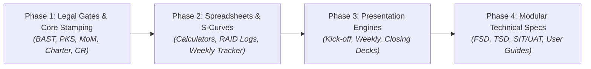

# Master Execution Handover: Universal Deliverable Recreation Engine

> **Repository:** `enterprise-bench`  
> **Status:** Strategic Baseline & Execution Blueprint  
> **Date:** September 2026  
> **Scope Calibration:** Focuses on establishing end-to-end recreation pipelines for representative, high-value enterprise deliverables across all project phases, without requiring 100% pixel-perfect reverse-engineering of static legacy appendices.

---

## 1. Executive Consensus & Architectural Decisions

Following architectural review of the 40 deliverable templates in [`clean_workspace/`](../../clean_workspace/), the following baseline decisions govern execution:

1. **Hybrid Tiering Architecture:**
   - **Tier 1 (Deterministic Legal & Governance Forms):** Jinja2 / `docxtpl` stamping on branded Word templates (`BAST`, `PKS`, `MoM`, `Charter`, `Change Request Form`).
   - **Tier 2 (High-Volume Technical Specifications):** Markdown-to-DOCX AST compilation for massive modular specs (`FSD`, `TSD`, `SIT/UAT Scenarios`, `User & Admin Guides`).
   - **Tier 3 (Spreadsheets & Calculators):** Python data injection via `openpyxl` with strict formula and formatting preservation (`Cloud Sizing`, `Mandays`, `S-Curve`, `RAID Logs`).
   - **Tier 4 (Executive Consulting Presentations):** Declarative YAML deck specifications rendered into high-contrast slides via `python-pptx` and [`ConsultingDeckBuilder`](../../src/ppt_engine/consulting_archetypes.py).
   - **Tier 5 (Architecture Diagrams):** Multi-page Draw.io and Mermaid-to-SVG vector pipelines for system dataflows and reporting schemas.

2. **Scope Calibration Disclaimer:**
   The workbench is not expected to brute-force a 100% byte-for-byte replica of every legacy historical document. Success is measured by having robust, parameterized generation workflows that produce audit-compliant, professionally branded deliverables for every key milestone in the lifecycle.

3. **Microsoft Project (`.mpp`) Role & Proprietary Format Boundary:**
   - **Enterprise PM Tooling Standard:** Microsoft Project (`.mpp`) is the foundational, specialized tool utilized by enterprise Project Managers for dependency linkages, dynamic critical path modeling, resource leveling, and task duration/manday allocation per team member.
   - **Dual-Asset Complementary Architecture:**
     - **Authoritative Planning Asset (`1.4_Project_Timeline_Baseline_Template.mpp`):** Maintained and managed directly by Project Managers inside Microsoft Project desktop for native Gantt and resource tracking.
     - **Downstream Reporting Asset (`1.4.1_Project_Timeline_Baseline_Template.xlsx`):** Serves as the spreadsheet export for stakeholder progress distributions, weekly status reporting, and S-curve cumulative variance tracking.
   - **Proprietary Format Disclaimer:** A pure Python or Excel-based implementation cannot faithfully mirror the full dynamic scheduling, resource leveling, and dependency network engine of Microsoft Project. The workbench retains `1.4_Project_Timeline_Baseline_Template.mpp` in `clean_workspace/` as an authoritative native template for PMs to clone and manage in MS Project, while automating the downstream Excel and deck reporting pipelines.


---

## 2. Tier 1: Deterministic Legal & Governance Stamping (DOCX)

### Scope
- `07_internal_legal_contracts/BAST_Milestone_1_Template.docx`
- `07_internal_legal_contracts/BAST_Milestone_2_Final_Template.docx`
- `07_internal_legal_contracts/BAST_Change_Request_Template.docx`
- `07_internal_legal_contracts/Perjanjian_Kerjasama_PKS_Template.docx`
- `02_initiating/1.2_Project_Charter_Template.docx`
- `05_monitoring/4.1_MoM_Minutes_of_Meeting_Template.docx`
- `05_monitoring/4.4_Change_Request_Form_Template.docx`
- `01_presales/Account_POC_Scope_Template.docx`

### Implementation Strategy
1. **Master Template Parameterization:**
   Convert static hardcoded text in `clean_workspace/` into standardized Jinja2 expressions (`{{ client_name }}`, `{{ contract_number }}`, `{{ date_formatted }}`, `{{ milestone_title }}`).
2. **Data Contracts (`src/core/models.py`):**
   Expand existing Pydantic models (`BASTPayload`, `MoMPayload`, `PKSPayload`, `CharterPayload`, `POCScopePayload`) to cover all variable fields.
3. **OpenXML Cleansing (`src/core/docx_purger.py`):**
   Run mandatory comment/highlight/revision purge prior to tokenization to prevent split `<w:r>` tags across Jinja tokens.
4. **Execution Command:**
   ```bash
   uv run bench doc stamp --template BAST_Milestone_1_Template.docx --data payload.json --output out/BAST_M1.docx
   ```

---

## 3. Tier 2: High-Volume Technical Specifications (Markdown -> DOCX)

### Scope
- `03_planning/2.3_Functional_Specification_Document_FSD_Template.docx` (Requires OpenXML repair)
- `04_executing/3.1_Technical_Specification_Document_TSD_Template.docx` (21.8 MB)
- `04_executing/3.3.1_SIT_Scenario_Backend_Template.docx` (7.6 MB)
- `04_executing/3.3.2_SIT_Scenario_Frontend_Template.docx` (3.2 MB)
- `04_executing/3.4_UAT_Scenario_Template.docx` (1.9 MB)
- `04_executing/3.6.1_User_Guide_Template.docx` (7.3 MB)
- `04_executing/3.6.2_Admin_Guide_Template.docx` (6.9 MB)
- `03_planning/2.1_Project_Management_Plan_Template.docx`

### Implementation Strategy
1. **OpenXML Healing for FSD:**
   Repair broken tag mismatch at line 2 (`rPr` vs `p`) in `2.3_Functional_Specification_Document_FSD_Template.docx` via `etree` AST reconstruction.
2. **Modular Markdown Source Structure:**
   Store large technical specifications as modular markdown files inside `specs/<project>/`:
   ```text
   specs/tti_analytics/tsd/
   ├── 01_architecture_overview.md
   ├── 02_snowflake_ddl_and_staging.md
   ├── 03_dbt_transformation_models.md
   ├── 04_rbac_and_security_matrix.md
   └── 05_performance_tuning.md
   ```
3. **Spec Compiler Engine (`src/docx_engine/spec_compiler.py`):**
   Build an automated Markdown-to-DOCX compiler that:
   - Uses an approved corporate reference template for fonts, heading styles, and page margins.
   - Automatically builds styled OpenXML tables for test scripts (`Test Case ID`, `Preconditions`, `Steps`, `Expected Result`, `Status`).
   - Formats SQL DDL and Python snippets into shaded monospace code callouts.
   - Embeds vector architecture diagrams dynamically compiled from Mermaid / Draw.io.

---

## 4. Tier 3: Spreadsheets & Sizing Calculators (XLSX)

### Scope
- `01_presales/Cloud_Sizing_Calculator_Template.xlsx`
- `01_presales/Timeline_and_Mandays_Estimate_Template.xlsx`
- `02_initiating/1.3_Stakeholders_Register_Template.xlsx`
- `02_initiating/1.4.1_Project_Timeline_Baseline_Template.xlsx`
- `04_executing/3.4_Timeline_UAT_Template.xlsx`
- `04_executing/3.6_Defect_List_Template.xlsx`
- `04_executing/3.7_Rundown_Deployment_Template.xlsx`
- `05_monitoring/4.2_Weekly_Progress_Timeline_Update_Template.xlsx`
- `05_monitoring/4.4_Change_Log_Ledger_Template.xlsx` (Active in `ChangeRequestProcessor`)
- `05_monitoring/4.5_Risk_Register_Template.xlsx`
- `05_monitoring/4.6_Issue_Log_Template.xlsx`
- `06_closing/5.2_Project_Closeout_Checklist_Template.xlsx`
- `07_internal_legal_contracts/CR_Scoping_and_Mandays_Template.xlsx` (Active)
- `07_internal_legal_contracts/Resource_Leave_Schedule_Template.xlsx`

### Implementation Strategy
1. **Preserve Formula Integrity & Validation Rules:**
   - Isolate calculation input cells from calculated formulas.
   - Do not overwrite formula cells; inject values only into raw parameter cells (e.g. `Calculator (live)!B4`).
2. **Defect Tracker & RAID Log Scaffolding:**
   Build lightweight data models in `src/xlsx_engine/ledger_models.py` (`RiskItem`, `IssueItem`, `DefectItem`, `StakeholderItem`) that append cleanly to the respective sheets without corrupting dropdown validation tables.
3. **Automated S-Curve Synchronization:**
   Connect `4.2_Weekly_Progress_Timeline_Update_Template.xlsx` directly to `SCurveGenerator` so weekly progress updates automatically refresh the embedded OpenXML line chart.

---

## 5. Tier 4: Consulting Presentation Decks (PPTX)

### Scope
- `01_presales/Modernize_Data_Platform_Pitch_Deck_Template.pptx` (36 slides)
- `02_initiating/1.1_Kick-off_Material_Template.pptx` (19 slides)
- `02_initiating/Project_Org_Structure_Template.pptx` (1 slide)
- `04_executing/3.4_Sosialisasi_UAT_Briefing_Template.pptx` (15 slides)
- `05_monitoring/4.2_Weekly_Progress_Report_Deck_Template.pptx` (11 slides)
- `06_closing/5.1_Project_Closing_Deck_Template.pptx` (9 slides)
- `clean_workspace/projects/KRA_ESG_Research/presentations/` (15 slides)

### Implementation Strategy
1. **Declarative Deck Spec Architecture (`presets/deck_configs/`):**
   Define deck structures in YAML configs:
   ```yaml
   deck_type: weekly_progress
   theme: modern_consulting
   metadata:
     client: Toyota Tsusho Indonesia
     project: Snowflake Financial Analytics
     week: 8
   slides:
     - archetype: cover_slide
       title: Executive Weekly Progress Report
       subtitle: Sprint 8 Milestones, Defect Burn-Down & S-Curve Variance
     - archetype: s_curve_variance_slide
       chart_source: output/weekly_tracker.xlsx
     - archetype: raid_summary_cards
       active_blockers: 2
       mitigated_risks: 5
   ```
2. **Archetype Expansion in `src/ppt_engine/consulting_archetypes.py`:**
   Add dedicated archetypes for recurring consulting patterns:
   - `build_project_governance_slide(...)` (Org structure hierarchy)
   - `build_weekly_status_summary_slide(...)` (Sprint velocity + Red/Amber/Green milestones)
   - `build_uat_training_overview_slide(...)` (3-column step process)
   - `build_closing_handover_slide(...)` (Contractual sign-off checklist)
3. **Execution Command:**
   ```bash
   uv run bench ppt build-deck --config presets/deck_configs/weekly_progress_template.yaml --output out/weekly_deck.pptx
   ```

---

## 6. Tier 5: Multi-Page Architecture Diagramming (Draw.io & SVG)

### Scope
- `03_planning/FSD_Architecture_Diagrams_Template.drawio` (17 multi-entity reporting pages)

### Implementation Strategy
1. **Page-by-Page Declarative Spec (`presets/diagrams/fsd_architecture.yaml`):**
   Specify entities and dataflows per page using Mermaid syntax with technology icon tags:
   ```yaml
   pages:
     - name: "Sales Use Case"
       theme: modern_consulting
       mermaid: |
         graph TD
           ERP["ERP SAP (Source)"] -->|Daily Batch| Staging["Snowflake STG_SALES"]
           Staging -->|dbt Transform| Semantic["FCT_SALES_AGG"]
           Semantic -->|Direct Query| Streamlit["Financial Analytics Portal"]
     - name: "Gross Profit Entities"
       mermaid: ...
   ```
2. **Multi-Page Compilation:**
   Execute `DrawIOProject.add_mermaid_page` across all declared pages, embedding official SVG technology emblems from `assets/icons/`.
3. **Bidirectional PNG/SVG Extraction:**
   Render high-resolution diagrams for automatic insertion into Tier 2 Word specifications (`FSD` and `TSD`).

---

## 7. Phased Execution Roadmap



### Phase 1: High-Priority Legal & Governance Stamping (Tier 1 Delivered)
- [x] Verified `2.3_Functional_Specification_Document_FSD_Template.docx` XML openability and AST integrity.
- [x] Parameterize `BAST_Milestone_1_Template.docx`, `BAST_Milestone_2_Final_Template.docx`, and `Perjanjian_Kerjasama_PKS_Template.docx`.
- [x] Parameterize `1.2_Project_Charter_Template.docx` and `4.1_MoM_Minutes_of_Meeting_Template.docx` with attendee list auto-expansion.
- [x] Complete `src/core/models.py` Pydantic schemas for all Phase 1 documents (`BASTPayload`, `PKSPayload`, `ProjectCharterPayload`, `MoMPayload`, `BASTChangeRequestPayload`).

### Phase 2: Spreadsheets, RAID & S-Curves (Tier 3 Delivered)
- [x] Parameterize `Cloud_Sizing_Calculator_Template.xlsx` with clean input coordinates and CLI command (`bench xlsx cloud-sizing`).
- [x] Build RAID log & Defect List injection helpers (`append-risk`, `append-issue`, `append-defect`, `append-stakeholder`).
- [x] Bind `SCurveGenerator` to `4.2_Weekly_Progress_Timeline_Update_Template.xlsx` via `TimelineAggregator` (`bench xlsx sync-s-curve`).

### Phase 3: Consulting Presentation Archetypes (Week 3)
- [ ] Implement `KickoffDeckBuilder`, `WeeklyProgressDeckBuilder`, and `ClosingDeckBuilder` in `src/ppt_engine`.
- [ ] Create declarative YAML deck configs in `presets/deck_configs/`.
- [ ] Verify asset resolution and graceful degradations via `bench ppt check-resources`.

### Phase 4: Modular Spec Compiler & Architecture Diagrams (Tier 2 Delivered)
- [x] Implement `src/docx_engine/spec_compiler.py` for Markdown -> styled DOCX with shaded code callouts, OpenXML scenario tables, and automated Mermaid figure compilation.
- [x] Author modular markdown source files for TSD (`specs/tti_analytics/tsd/`) and UAT test scenarios (`specs/tti_analytics/sit_uat/`).
- [x] Integrate unified CLI command `uv run bench doc compile-spec` with single file and directory batch modes.
- [ ] Recreate the 17-page `FSD_Architecture_Diagrams_Template.drawio` from declarative Mermaid specs.

