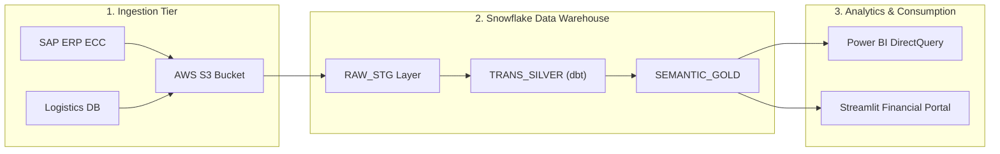

# 1. System Architecture Overview

## 1.1 Executive Summary & Architectural Goals
The modern Enterprise Data Platform for Nusantara Global Logistics is engineered to consolidate distributed operational, sales, and financial datasets into a centralized **Snowflake Cloud Data Warehouse on AWS (ap-southeast-3 Jakarta Region)**. 

The primary architectural imperatives of this platform include:
* **Near Real-Time Data Ingestion:** Automated ingestion pipelines extracting operational transactions from on-premise ERP (SAP ECC), logistics tracking databases, and operational spreadsheets.
* **Separation of Compute and Storage:** Independent virtual warehouses allocated to distinct workloads (ETL, ad-hoc analyst exploration, executive dashboards) eliminating compute resource contention.
* **Granular Role-Based Access Control (RBAC):** Strict corporate governance enforcing Department-level and Region-level dynamic data masking on sensitive financial figures.
* **Semantic Layer & BI Integration:** Clean dimensional models orchestrated via dbt Core serving Power BI and Streamlit executive reporting portals.

> [!NOTE]
> All infrastructure resources are provisioned strictly within the AWS Jakarta (ap-southeast-3) cloud perimeter to satisfy regional data residency and compliance regulations (UU PDP 2022).

---

## 1.2 End-to-End Data Flow Architecture

The data pipeline transitions operational transactions through five discrete architectural tiers:
1. **Source Tier:** Core SAP ERP tables, logistics databases, and transactional flat files.
2. **Ingestion Tier:** Azure Data Factory / AWS Transfer Family landing raw files into Amazon S3 storage buckets.
3. **Snowflake Staging (`RAW_STG`):** External tables and Snowpipe micro-batch loaders maintaining immutable raw data.
4. **Transformation Tier (`SEMANTIC_DWH`):** dbt Core models executing medallion transformations (Bronze -> Silver -> Gold).
5. **Consumption Tier:** Power BI DirectQuery datasets and Streamlit financial analytics applications.

---

## 1.3 Core Architectural Decisions & Principles

The following architectural design records (ADRs) govern this implementation:

| ADR ID | Architectural Decision | Selected Pattern / Technology | Rationale & Trade-Offs |
|:---|:---|:---|:---|
| **ADR-01** | Cloud Data Platform | Snowflake Enterprise Edition (AWS Jakarta) | Native time travel, zero-copy cloning, micro-partitioning, and automatic scaling. |
| **ADR-02** | Transformation Engine | dbt Core (v1.8+) | Version-controlled SQL modeling, automated testing, documentation, and lineage graphs. |
| **ADR-03** | Storage Hierarchy | Amazon S3 Standard with Glacier Lifecycle | High durability (99.999999999%) and cost-efficient archival after 90 days. |
| **ADR-04** | Security & Masking | Snowflake Tag-Based Dynamic Data Masking | Automated masking of PII, tax IDs, and executive margins without query rewriting. |
| **ADR-05** | BI Connectivity | Power BI Gateway via DirectQuery | Ensures zero data duplication; queries push down compute directly to Snowflake virtual warehouses. |

> [!IMPORTANT]
> Virtual warehouse auto-suspend is calibrated to **60 seconds** across all standard developer and analyst warehouses to eliminate idle compute credit consumption.
