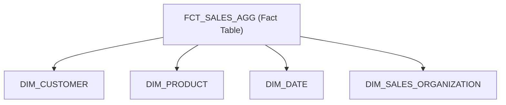

# 3. dbt Transformation Models & Semantic Layer

## 3.1 Dimensional Modeling Architecture

The transformation tier leverages a dimensional Kimball star schema designed for optimal OLAP analytical performance and seamless Power BI DAX querying:



---

## 3.2 Conformed Dimension: `DIM_CUSTOMER`

The customer dimension captures customer master attributes with Type 2 Slowly Changing Dimension (SCD Type 2) tracking for historical regional reassignments:

| Column Name | Data Type | Constraint | Description |
|:---|:---|:---|:---|
| `CUSTOMER_SK` | `NUMBER(38,0)` | PRIMARY KEY | Surrogate key generated via MD5 hash |
| `CUSTOMER_ID` | `VARCHAR(10)` | NOT NULL | Natural key from SAP ECC KNA1 |
| `CUSTOMER_NAME` | `VARCHAR(100)` | NOT NULL | Registered corporate legal entity name |
| `INDUSTRY_SECTOR` | `VARCHAR(50)` | NULL | Automotive, Manufacturing, Trading, or Electronics |
| `CREDIT_LIMIT_IDR`| `NUMBER(18,2)` | NULL | Credit ceiling approved by treasury |
| `VALID_FROM` | `TIMESTAMP_LTZ`| NOT NULL | SCD Type 2 record effective start timestamp |
| `VALID_TO` | `TIMESTAMP_LTZ`| NULL | SCD Type 2 record expiration timestamp (NULL = Current) |
| `IS_CURRENT` | `BOOLEAN` | NOT NULL | Flag indicating active customer record |

---

## 3.3 Core Fact Model: `FCT_SALES_AGG.sql`

The following dbt model aggregates order transactions into daily grain per customer and product:

```sql
{{ config(
    materialized='incremental',
    unique_key='SALES_AGG_SK',
    cluster_by=['TRANSACTION_DATE', 'CUSTOMER_SK'],
    schema='GOLD_SALES'
) }}

WITH source_orders AS (
    SELECT * FROM {{ ref('stg_sap_sales_orders') }}
    
    WHERE ETL_LOADED_AT > (SELECT MAX(ETL_LOADED_AT) FROM {{ this }})
    
),

customer_dim AS (
    SELECT CUSTOMER_SK, CUSTOMER_ID
    FROM {{ ref('dim_customer') }}
    WHERE IS_CURRENT = TRUE
),

product_dim AS (
    SELECT PRODUCT_SK, MATERIAL_NUMBER
    FROM {{ ref('dim_product') }}
)

SELECT
    MD5(CONCAT(so.SALES_DOC_NUMBER, '_', so.ITEM_NUMBER)) AS SALES_AGG_SK,
    so.CREATED_ON AS TRANSACTION_DATE,
    cd.CUSTOMER_SK,
    pd.PRODUCT_SK,
    so.SALES_ORG,
    SUM(so.ORDER_QUANTITY) AS TOTAL_ORDER_QTY,
    SUM(so.NET_VALUE_IDR) AS TOTAL_NET_REVENUE_IDR,
    SUM(so.TAX_AMOUNT_IDR) AS TOTAL_TAX_IDR,
    CURRENT_TIMESTAMP() AS ETL_LOADED_AT
FROM source_orders so
LEFT JOIN customer_dim cd ON so.CUSTOMER_ID = cd.CUSTOMER_ID
LEFT JOIN product_dim pd ON so.MATERIAL_NUMBER = pd.MATERIAL_NUMBER
GROUP BY 1, 2, 3, 4, 5;
```

---

## 3.4 Data Quality & Testing Matrix

dbt schema tests enforce data integrity constraints automatically on every scheduled daily pipeline execution:

```yaml
version: 2
models:
  - name: fct_sales_agg
    description: "Daily aggregated sales performance fact table"
    columns:
      - name: SALES_AGG_SK
        tests:
          - unique
          - not_null
      - name: TRANSACTION_DATE
        tests:
          - not_null
      - name: TOTAL_NET_REVENUE_IDR
        tests:
          - not_null
          - dbt_expectations.expect_column_values_to_be_between:
              min_value: 0
```

> [!TIP]
> In incremental runs, dbt applies micro-batch partition filtering using `cluster_by=['TRANSACTION_DATE']`, reducing Snowflake credit consumption by over 65% during daily morning updates.
