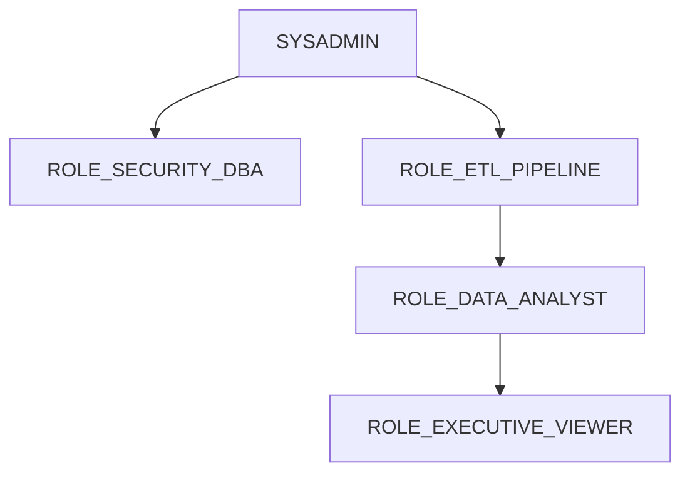

# 4. Role-Based Access Control (RBAC) & Data Governance

## 4.1 Functional Role Hierarchy

Access privileges adhere to the principle of least privilege (PoLP) through functional and object-level role segregation:



---

## 4.2 Role Permission & Object Privilege Matrix

| Role Identifier | Assigned Workload / Users | DB Access Level | Warehouse | Masking Visibility |
|:---|:---|:---|:---|:---|
| `ROLE_SECURITY_DBA` | Platform Engineers & DBAs | `ALL` on `NGL_*_DB` | `WH_ADMIN_XS` | Full (Unmasked) |
| `ROLE_ETL_PIPELINE` | Airflow & dbt Service Accounts | `READ/WRITE` on `RAW`, `SILVER`, `GOLD` | `WH_TRANSFORM_M` | Full (ETL processing) |
| `ROLE_DATA_ANALYST` | Corporate Financial Analysts | `SELECT` on `GOLD_*`, `SILVER` | `WH_REPORTING_S` | Partial Masking (PII masked) |
| `ROLE_EXECUTIVE_VIEWER` | Directors & C-Level Executives | `SELECT` on `GOLD_*` | `WH_REPORTING_S` | Summary Aggregations |
| `ROLE_AUDITOR` | Internal & External Compliance | `SELECT` on Governance Audit Tables | `WH_ADMIN_XS` | Full Masking (Anonymized) |

---

## 4.3 Dynamic Data Masking Policies

To protect sensitive Indonesian fiscal identifiers (NPWP - Tax ID) and individual customer names, dynamic masking policies apply automatically based on session role:

```sql
-- Dynamic Data Masking for Customer Tax ID (NPWP)
CREATE OR REPLACE MASKING POLICY NGL_GOVERNANCE_DB.POLICIES.MASK_NPWP AS (val string) 
RETURNS string ->
  CASE
    WHEN CURRENT_ROLE() IN ('ROLE_SECURITY_DBA', 'ACCOUNTADMIN') THEN val
    WHEN CURRENT_ROLE() IN ('ROLE_ETL_PIPELINE') THEN val
    ELSE CONCAT('XX.XXX.XXX.X-', SUBSTR(val, 13, 3), '.XXX')
  END;

-- Apply Policy to Customer Master Table
ALTER TABLE NGL_ANALYTICS_DB.SILVER.DIM_CUSTOMER 
  MODIFY COLUMN TAX_IDENTIFICATION_NUMBER 
  SET MASKING POLICY NGL_GOVERNANCE_DB.POLICIES.MASK_NPWP;
```

---

## 4.4 Network Security & IP Restrictions

Access to the Snowflake production account is restricted exclusively to authorized enterprise network CIDRs via Snowflake Network Policies:

* **Headquarters VPN Gateway (MidPlaza 2 Jakarta):** `103.28.144.0/24`
* **Operational Warehouse / Logistics Facility:** `103.111.82.0/26`
* **AWS PrivateLink Integration:** Direct VPC peering connecting Snowflake and client AWS accounts without routing over the public internet.

> [!CAUTION]
> Direct public internet ingress without multi-factor authentication (MFA) or Duo Security SSO is blocked by default across all user accounts.
